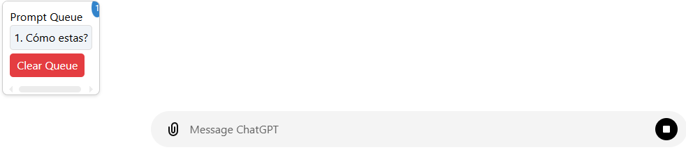
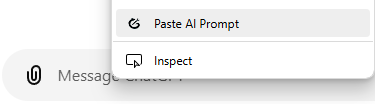

# Tails: Tools for AIs <!-- omit in toc -->

[spanish](README.md) | [english](README.en.md)

This is a Chromium-based browser extension that adds additional functionalities to popular online LLM chatbots, such as [Claude](claude.ai), [ChatGPT](chat.com), [Perplexity](perplexity.ai), [Gemini](gemini.google.com), and all that may arise and be of interest.

# Index <!-- omit in toc -->

- [Features](#features)
  - [Dark mode compatible user interface](#dark-mode-compatible-user-interface)
  - [Custom prompts](#custom-prompts)
  - [Message queue](#message-queue)
  - [Prompt suggestion in the context menu](#prompt-suggestion-in-the-context-menu)
- [Compatibility](#compatibility)
- [Installation](#installation)
  - [Chrome](#chrome)
  - [Opera](#opera)
  - [Microsoft Edge](#microsoft-edge)

# Features

## Dark mode compatible user interface

This extension is responsive to the dark mode interface, so you can keep chatting in style.

## Custom prompts

Add your own custom prompts so you can reuse them in your conversations, which you can also auto send.


## Message queue

Save messages in a queue to send them when the model is ready to receive them.



## Prompt suggestion in the context menu

Add a button in the context menu to suggest a generally useful prompt for all kinds of conversations.



# Compatibility

- [X] Claude
- [X] ChatGPT
- [ ] Perplexity
- [ ] Gemini

# Installation

## Chrome

> Video tutorial at [video](https://www.youtube.com/watch?v=oswjtLwCUqg) (24s).

1. Clone the repository from GitHub:
   ```
   git clone https://github.com/matias-saavedra-g/tails.git
   ```

2. Open Chrome and navigate to `chrome://extensions/`.

3. Enable developer mode (Developer Mode) in the upper right corner of the page.

4. Click on "Load unpacked", then select the cloned extension folder (U-Cursedn't).

5. The extension should load and appear in the list of installed extensions.

## Opera

> Video tutorial at [video](https://www.youtube.com/watch?v=5X9wGp3kWwA) (86s).

1. Clone the repository from GitHub:
   ```
   git clone https://github.com/matias-saavedra-g/tails.git
   ```

2. Open Opera and visit `opera://extensions/`.

3. Click on "Load unpacked", then select the cloned extension folder (U-Cursedn't).

4. The extension should load and appear in the list of installed extensions.

## Microsoft Edge

> Video tutorial at [video](https://www.youtube.com/watch?v=ruMPPADElqU) (39s).

1. Clone the repository from GitHub:
   ```
   git clone https://github.com/matias-saavedra-g/tails.git
   ```

2. Open Microsoft Edge and navigate to `edge://extensions/`.

3. Enable developer mode (Developer Mode) in the lower left corner of the page.

4. Click on "Load unpacked", then select the cloned extension folder (U-Cursedn't).

5. The extension should load and appear in the list of installed extensions.