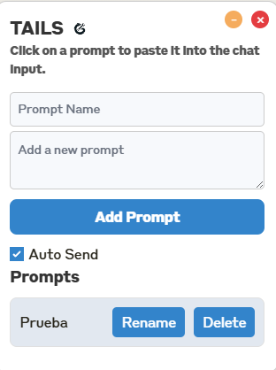
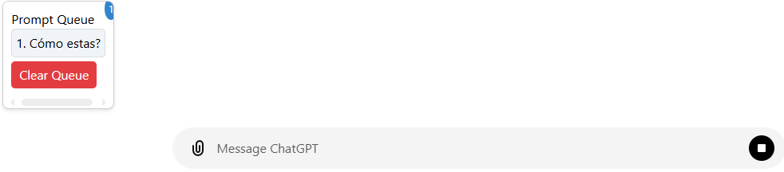
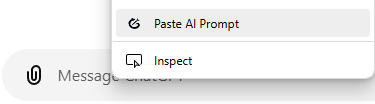

# Tails: Tools for AIs <!-- omit in toc -->

[spanish](README.md) | [english](README.en.md)

Esta es una extensión de navegadores basados en Chromium que agrega funcionalidades adicionales a los populares chatbots de LLMs en línea, como serían [Claude](claude.ai), [ChatGPT](chat.com), [Perplexity](perplexity.ai), [Gemini](gemini.google.com), y todos los que vayan surgiendo y sean de interés.

# Índice <!-- omit in toc -->

- [Características](#características)
  - [Interfaz de usuario compatible con modo oscuro](#interfaz-de-usuario-compatible-con-modo-oscuro)
  - [Prompts personalizados](#prompts-personalizados)
  - [Cola de mensajes](#cola-de-mensajes)
  - [Sugerencia de prompt en el menú contextual](#sugerencia-de-prompt-en-el-menú-contextual)
- [Compatibilidad](#compatibilidad)
- [Instalación](#instalación)
  - [Chrome](#chrome)
  - [Opera](#opera)
  - [Microsoft Edge](#microsoft-edge)

# Características

## Interfaz de usuario compatible con modo oscuro

Esta extensión es responsiva a la interfaz de modo oscuro, para que puedas seguir chateando con estilo.

## Prompts personalizados

Agrega tus propios prompts personalizados para que puedas reutilizarlos en tus conversaciones, que también puedes auto enviar.



## Cola de mensajes

Guarda mensajes en una cola para enviarlos en el momento en que el modelo esté listo para recibirlos.



## Sugerencia de prompt en el menú contextual

Agrega un botón en el menú contextual para sugerir un prompt generalmente útil para todo tipo de conversaciones.



# Compatibilidad

- [X] Claude
- [X] ChatGPT
- [ ] Perplexity
- [ ] Gemini

# Instalación

## Chrome

> Tutorial en [video](https://www.youtube.com/watch?v=oswjtLwCUqg) (24s).

1. Clonar el repositorio desde GitHub:
   ```
   git clone https://github.com/matias-saavedra-g/tails.git
   ```

2. Abrir Chrome y navegar a `chrome://extensions/`.

3. Habilitar el modo desarrollador (Developer Mode) en la esquina superior derecha de la página.

4. Click en "Load unpacked" (Cargar extensión sin empaquetar), luego seleccionar la carpeta clonada de la extensión.

5. La extensión debería cargarse y aparecer en la lista de extensiones instaladas.

## Opera

> Tutorial en [video](https://www.youtube.com/watch?v=5X9wGp3kWwA) (86s).

1. Clonar el repositorio desde GitHub:
   ```
   git clone https://github.com/matias-saavedra-g/tails.git
   ```

2. Abrir Opera y visitar `opera://extensions/`.

3. Click en "Load unpacked" (Cargar extensión sin empaquetar), luego seleccionar la carpeta clonada de la extensión.

4. La extensión debería cargarse y aparecer en la lista de extensiones instaladas.

## Microsoft Edge

> Tutorial en [video](https://www.youtube.com/watch?v=ruMPPADElqU) (39s).

1. Clonar el repositorio desde GitHub:
   ```
   git clone https://github.com/matias-saavedra-g/tails.git
   ```

2. Abrir Microsoft Edge y navegar a `edge://extensions/`.

3. Habilitar el modo desarrollador (Developer Mode) en la esquina inferior izquierda de la página.

4. Click en "Load unpacked" (Cargar extensión sin empaquetar), luego seleccionar la carpeta clonada de la extensión.

5. La extensión debería cargarse y aparecer en la lista de extensiones instaladas.
